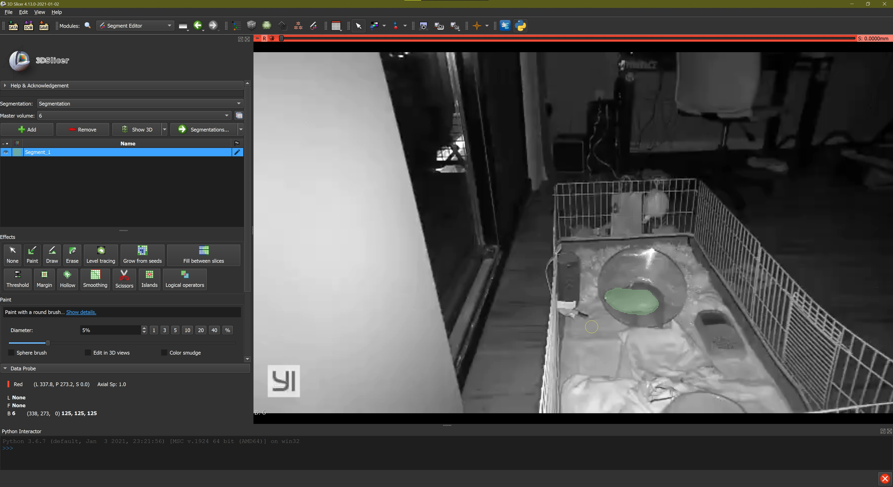
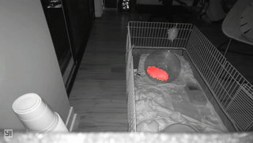

# HedgeHog Finder

## Making dataset

- mp4 to png done with [convert_video.bat](convert_videos.bat)
- segmentations done with [slicer](https://www.slicer.org/)



- The annotations were saved as `.nrrd` in the [mask directory](segmentation/masks)
- Then converted to `.png` files for training using [prepare_dataset.py](segmentation/prepare_dataset.py)

## Segmentation

### [model training](segmentation/segmentation_train.ipynb)

- The current version utilizes transfer learning and data augmentation with [the fastai library](https://docs.fast.ai/tutorial.vision.html) to train a segmentation model with a small hand-annotated dataset

### [model inference](segmentation/inference.py)

- turned into a command line program using [hedgiefinder](segmentation/hedgiefinder.py):

```bash
python segmentation/hogfinder.py path/to/hedgehog_video.mp4
```



### Analysis

- using the segmentation maps generated with [hedgiefinder](segmentation/hedgiefinder.py), Xiaomi's location over time can be tracked as the coordinates (x, y) at the center of each segmentation, (found using [sci-kit image regionprops](https://scikit-image.org/docs/dev/api/skimage.measure.html))
  - [label_centers](center_of_mass/label_centers.py) is the relevant script for finding these coordinates
  - Finally, the sum of all these points over time is overlaid across a single from using [where_is_xiaomi.py](center_of_mass/where_is_xiaomi.py) to get a heat map of the night's activity

