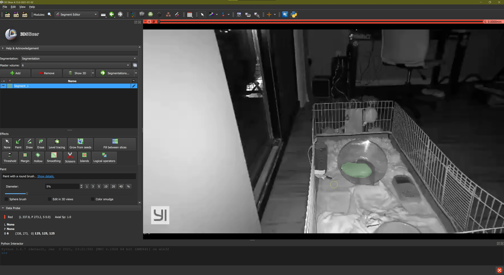
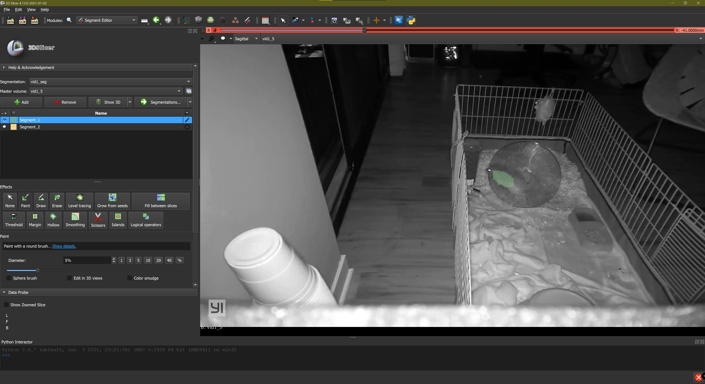
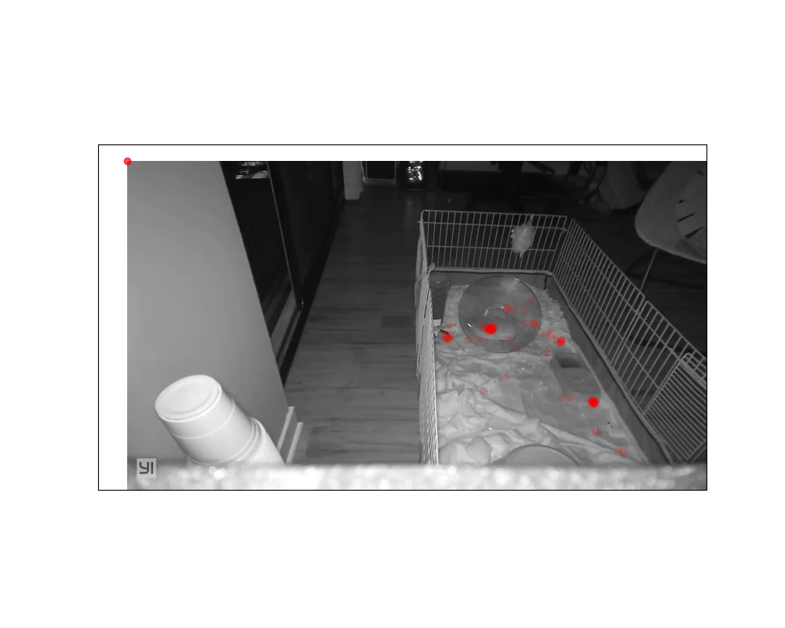

# HedgeHog Finder

## Making dataset

- mp4 to png done with [convert_video.bat](convert_videos.bat)
- segmentations done with [slicer](https://www.slicer.org/)



- The annotations were saved as `.nrrd` in the [mask directory](segmentation/masks)
- Then converted to `.png` files for training using [prepare_dataset.py](segmentation/prepare_dataset.py)

## Segmentation

### [model training](segmentation/segmentation_train.ipynb)

- The current version utilizes transfer learning and data augmentation with [the fastai library](https://docs.fast.ai/tutorial.vision.html) to train a segmentation model with a small hand-annotated dataset

### [model inference](segmentation/inference.py)

- turned into a command line program using [hedgiefinder](segmentation/hedgiefinder.py):

```bash
python segmentation/hedgiefinder.py path/to/hedgehog_video.mp4
```


- gif made with [make_preview_gif.bat](segmentation/make_preview_gif.bat)

### Continuous training



[prepare_dataset](data/prepare_dataset.py) includes option to convert corrected nrrd files 
### Analysis

- using the segmentation maps generated with [hedgiefinder](segmentation/hedgiefinder.py), Xiaomi's location over time can be tracked as the coordinates (x, y) at the center of each segmentation, (found using [sci-kit image regionprops](https://scikit-image.org/docs/dev/api/skimage.measure.html))
  - [label_centers](center_of_mass/label_centers.py) is the relevant script for finding these coordinates
  - Finally, the sum of all these points over time is overlaid across a single from using [where_is_xiaomi.py](center_of_mass/where_is_xiaomi.py) to get a heat map of the night's activity



## Other Applications

```python
from hedgiefinder import predict_overlay_url
 predict_overlay_url('old/vid1.mp4', 'https://emojipedia-us.s3.dualstack.us-west-1.amazonaws.com/thumbs/240/mozi
   ...: lla/36/pile-of-poo_1f4a9.png', videoname = 'stinky_girl.mp4', sz = (100, 100))
```


### Making a web app

- consider making a Docker image of the model and make a streamlit app
- have upload option to upload single photo, group of photos or video
- see result and then option to download as video or gif
- option for overlay or segmentation
- could host using digital ocean again: https://cloud.digitalocean.com/droplets/new?i=f7a007&size=s-4vcpu-8gb&region=sfo3
- Alternatively can checkout this blog: <https://towardsdatascience.com/deploy-machine-learning-model-on-google-kubernetes-engine-94daac85108b>
